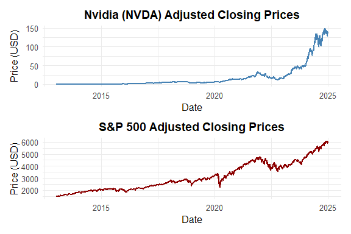
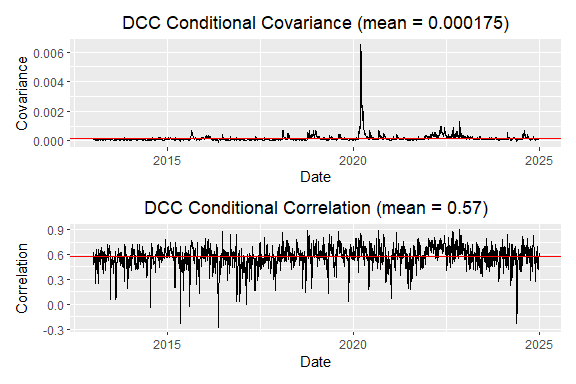

NVDA_S&P500
================
Elena
2025-04-06

- [About this project](#about-this-project)
- [Research Question](#research-question)
- [Dataset description](#dataset-description)
- [EDA](#eda)
- [Volatility Modeling](#volatility-modeling)
  - [GARCH(0,5) Baseline Model](#garch05-baseline-model)
  - [GARCH(1,1)](#garch11)
  - [EWMA (added for comparison)](#ewma-added-for-comparison)
  - [DCC-GARCH(1,1) Dynamic Correlation
    Model](#dcc-garch11-dynamic-correlation-model)

## About this project

In this project, we explore and model the volatility of NVIDIA’s (NVDA)
daily stock returns using ARCH and GARCH models. The analysis includes
exploratory data analysis (EDA), stationarity and normality tests, and
fitting time-varying volatility models to better understand the risk and
dynamics of NVIDIA’s return series.

## Research Question

Which volatility model best captures the time-varying and persistent
volatility in NVIDIA’s daily stock returns: ARCH or GARCH?

## Dataset description

The dataset used in this project contains daily adjusted closing prices
of NVIDIA (NVDA) stock obtained from Yahoo Finance using the quantmod R
package.

- **Time period covered:** January 3, 2013 to December 29, 2024

- **Frequency:** Daily (trading days)

- **Total observations:** 3,035 daily prices

- **Variable of interest:** Daily log returns computed from adjusted
  closing prices

- **Missing values:** None after filtering and cleaning

This dataset is well-suited for financial time series modeling as it
captures volatility clustering, heavy tails, and high persistence in
returns, all of which are characteristic of equity market behavior.

**Research question:**

**How does the relationship between NVIDIA and the S&P 500 evolve over
time, and which volatility model best captures their joint dynamics for
risk and portfolio analysis?**

## EDA

``` r
# Installing packages 
required_packages <- c("quantmod", "ggplot2", "PerformanceAnalytics", "tseries", 
                       "fGarch", "zoo", "rugarch", "rmarkdown", "patchwork", "FinTS", "rmgarch")

new_packages <- required_packages[!(required_packages %in% installed.packages()[,"Package"])]
if(length(new_packages)) install.packages(new_packages)
# Loading libraries
library(patchwork)
library(quantmod)
library(ggplot2)
library(PerformanceAnalytics)
library(tseries)
library(fGarch)
library(zoo)
library(rugarch)
library(rmarkdown)
library(xts)
library(FinTS)
library(ggpmisc)
library(rmgarch)

options(digits=4)
```

Data loading

    ## [1] "NVDA" "GSPC"

    ## [1] "NVDA.Open"     "NVDA.High"     "NVDA.Low"      "NVDA.Close"   
    ## [5] "NVDA.Volume"   "NVDA.Adjusted"

    ## [1] "2013-01-02"

    ## [1] "2024-12-30"

    ## [1] "GSPC.Open"     "GSPC.High"     "GSPC.Low"      "GSPC.Close"   
    ## [5] "GSPC.Volume"   "GSPC.Adjusted"

    ## [1] "2013-01-02"

    ## [1] "2024-12-30"

    ##         Date NVDA.Adjusted GSPC.Adjusted
    ## 1 2013-01-02        0.2935          1462
    ## 2 2013-01-03        0.2937          1459
    ## 3 2013-01-04        0.3034          1466
    ## 4 2013-01-07        0.2946          1462
    ## 5 2013-01-08        0.2882          1457
    ## 6 2013-01-09        0.2817          1461

We uploaded libraries and downloaded the data for the period
2013-01-01 - 2024-12-31. Let’s build lineplots for Nvidia and S&P500
adjusted closing prices

<!-- -->

We convert adj closing prices to log returns to make the data
stationary: prices tend to drift over time while log returns remain
stable.

``` r
# Log-returns calculation
NVDA.ret <- diff(log(NVDA))  # NVDA is xts
GSPC.ret <- diff(log(GSPC))  # GSPC is xts

NVDA.GSPC.ret <- na.omit(merge(NVDA.ret, GSPC.ret))

X <- data.frame(Date = index(NVDA.GSPC.ret), coredata(NVDA.GSPC.ret))
colnames(X)[2:3] <- c("NVDA_lr", "GSPC_lr")

# Checking structure
str(X)
```

    ## 'data.frame':    3018 obs. of  3 variables:
    ##  $ Date   : Date, format: "2013-01-03" "2013-01-04" ...
    ##  $ NVDA_lr: num  0.000786 0.03246 -0.029323 -0.022171 -0.022673 ...
    ##  $ GSPC_lr: num  -0.00209 0.00485 -0.00313 -0.00325 0.00265 ...

``` r
# Log returns Plot
p<-ggplot(data = X, aes(x = Date)) +
  geom_line(aes(y = NVDA_lr, color = "NVDA")) +
  geom_line(aes(y = GSPC_lr, color = "GSPC")) +
  labs(title = "log returns: NVDA vs S&P 500",
       x = "date", y = "log returns") +
  scale_color_manual(values = c("NVDA" = "steelblue", "GSPC" = "darkred")) +
  theme_minimal()
print(p)
```

<!-- -->

In this chunk we are fitting a linear regression without an intercept to
model the relationship between the log returns of NVDA and the S&P 500.
What do we see here?

- Moderate Linear Dependence: About 40% of the variability in the S&P
  500’s log returns can be explained by the log returns of NVDA. This
  suggests a moderate co-movement between the two assets.

- Beta = 0.23903. As beta \< 1, NVDA’s movements explain only a small
  fraction of S&P 500’s return movements.

NVDA moves less than the market.

- The correlation is moderate, as shown by your R^2 = 0.405, only about
  40% of the variation in GSPC returns can be explained by NVDA’s
  returns.

- Portfolio Implication: NVDA does not move perfectly with the market
  meaning diversification benefits exist. But because 40% is explained,
  NVDA has a meaningful market exposure.

- Risk Modeling Use: You now know that NVDA and S&P 500 share moderate
  systematic risk. That info is useful for covariance estimation,
  Value-at-Risk, or building a two-asset hedge.

``` r
# Regression without intercept on log returns:
reg <- y ~ -1 + x  

# Scatter plot 
p <- ggplot(data = X, aes(x = NVDA_lr, y = GSPC_lr)) +
  ggtitle("Log Returns: NVDA vs GSPC with Linear Regression Fit") +
  labs(x = "NVDA Log Returns", y = "GSPC Log Returns") +
  geom_point(alpha = 0.5) +
  geom_smooth(method = "lm", se = FALSE, color = "red", formula = reg) +
  stat_poly_eq(formula = reg,
               eq.with.lhs = "italic(hat(y))~`=`~",
               aes(label = paste(..eq.label.., ..rr.label.., sep = "*plain(\",\")~")),
               parse = TRUE) +
  theme(plot.title = element_text(hjust = 0.5))

print(p)
```

<!-- -->

``` r
summary(lm(GSPC_lr ~ NVDA_lr - 1, data = X))
```

    ## 
    ## Call:
    ## lm(formula = GSPC_lr ~ NVDA_lr - 1, data = X)
    ## 
    ## Residuals:
    ##      Min       1Q   Median       3Q      Max 
    ## -0.07890 -0.00384  0.00033  0.00420  0.06313 
    ## 
    ## Coefficients:
    ##         Estimate Std. Error t value Pr(>|t|)    
    ## NVDA_lr  0.23903    0.00528    45.3   <2e-16 ***
    ## ---
    ## Signif. codes:  0 '***' 0.001 '**' 0.01 '*' 0.05 '.' 0.1 ' ' 1
    ## 
    ## Residual standard error: 0.00824 on 3017 degrees of freedom
    ## Multiple R-squared:  0.405,  Adjusted R-squared:  0.404 
    ## F-statistic: 2.05e+03 on 1 and 3017 DF,  p-value: <2e-16

``` r
cor(X$NVDA, X$GSPC)^2
```

    ## [1] 0.4036

**ADF test**checks if a time series is non-stationary due to a unit
root. - Null Hypothesis (H₀): Series has a unit root → non-stationary -
Alternative Hypothesis (H₁): Series is stationary Results: Because the
p-values are \< 0.05, we reject H₀ and conclude that both NVDA and GSPC
log returns are stationary.

**KPSS test**also checks for stationarity. - Null Hypothesis (H₀):
Series is stationary - Alternative Hypothesis (H₁): Series is
non-stationary

Results: The p-values \> 0.05, so we fail to reject H₀ and conclude the
series are stationary.

**Jarque Bera**tests whether the data follows a normal distribution. -
Null Hypothesis (H₀): Data is normally distributed - Alternative
Hypothesis (H₁: Data is not normally distributed Results: The p-values
\< 0.05, so we reject H₀ and conclude the series are not normally
distributed.

``` r
colnames(X)[2:3] <- c("NVDA_lr", "GSPC_lr")

# Stationarity Tests
# ADF
adf_nvda <- adf.test(X$NVDA_lr, alternative = "stationary")
adf_gspc <- adf.test(X$GSPC_lr, alternative = "stationary")
print(adf_nvda)
```

    ## 
    ##  Augmented Dickey-Fuller Test
    ## 
    ## data:  X$NVDA_lr
    ## Dickey-Fuller = -15, Lag order = 14, p-value = 0.01
    ## alternative hypothesis: stationary

``` r
print(adf_gspc)
```

    ## 
    ##  Augmented Dickey-Fuller Test
    ## 
    ## data:  X$GSPC_lr
    ## Dickey-Fuller = -15, Lag order = 14, p-value = 0.01
    ## alternative hypothesis: stationary

``` r
# KPSS Test
kpss_nvda <- kpss.test(X$NVDA_lr, null = "Level")
kpss_gspc <- kpss.test(X$GSPC_lr, null = "Level")
print(kpss_nvda)
```

    ## 
    ##  KPSS Test for Level Stationarity
    ## 
    ## data:  X$NVDA_lr
    ## KPSS Level = 0.1, Truncation lag parameter = 9, p-value = 0.1

``` r
print(kpss_gspc)
```

    ## 
    ##  KPSS Test for Level Stationarity
    ## 
    ## data:  X$GSPC_lr
    ## KPSS Level = 0.028, Truncation lag parameter = 9, p-value = 0.1

``` r
# Normality Test (Jarque-Bera)
jb_nvda <- jarque.bera.test(X$NVDA_lr)
jb_gspc <- jarque.bera.test(X$GSPC_lr)
print(jb_nvda)
```

    ## 
    ##  Jarque Bera Test
    ## 
    ## data:  X$NVDA_lr
    ## X-squared = 7742, df = 2, p-value <2e-16

``` r
print(jb_gspc)
```

    ## 
    ##  Jarque Bera Test
    ## 
    ## data:  X$GSPC_lr
    ## X-squared = 34626, df = 2, p-value <2e-16

The ACF and PACF plots for NVDA log returns show weak autocorrelation
with only a few significant spikes, suggesting limited serial dependence
and a pattern close to white noise. In contrast, S&P 500 returns exhibit
more pronounced autocorrelation with several significant spikes in both
ACF and PACF, indicating the presence of short-term dependencies.

``` r
par(mfrow = c(2, 2))  # 2x2 plot layout
acf(X$NVDA_lr, main = "ACF: NVDA Log Returns")
pacf(X$NVDA_lr, main = "PACF: NVDA Log Returns")
acf(X$GSPC_lr, main = "ACF: GSPC Log Returns")
pacf(X$GSPC_lr, main = "PACF: GSPC Log Returns")
```

<!-- -->

``` r
par(mfrow = c(1, 1))  
```

Markets are dynamic and relationships between NVDA and the S&P 500 may
change over time. Static correlation may miss periods of high or low
correlation, shifts in volatility regimes or co-movement behavior.

Instead of calculating one correlation value over the whole dataset, we
calculate it over a moving window (60 trading days or 3 months). We see
that there are periods when correlation was high (near 1) meaning NVDA
and S&P 500 moved together. No negative correlation but somtimes
correlation dropped to 0 indicating that NVDA and S&P diverged. There is
a lot of fluctuation in the plot, their relationship is not constant and
depends on market conditions.

``` r
# Converting to xts object
NVDA.GSPC.ret.xts <- xts(X[, c("NVDA_lr", "GSPC_lr")], order.by = X$Date)

# Rolling 60-day window
rolling_cov <- rollapply(NVDA.GSPC.ret.xts, width = 60, FUN = function(x) cov(x[,1], x[,2]),
                         by.column = FALSE, align = "right")

rolling_cor <- rollapply(NVDA.GSPC.ret.xts, width = 60, FUN = function(x) cor(x[,1], x[,2]),
                         by.column = FALSE, align = "right")

# ggplot
rolling_cor_df <- data.frame(Date = index(rolling_cor), RollingCorrelation = coredata(rolling_cor))
p5 <- ggplot(rolling_cor_df, aes(x = Date, y = RollingCorrelation)) + 
  geom_line(color = "purple") + 
  ggtitle("60-Day Rolling Correlation: NVDA vs GSPC") +
  labs(x = "Date", y = "Rolling Correlation") +
  theme_minimal()

print(p5)
```

<!-- -->

It is time to perform ARCH tests to see whether volatility clusters over
time: if periods of high volatility tend to follow each other, and same
for low volatility.

- Null Hypothesis (H₀): No ARCH effect (constant variance).

- Alternative Hypothesis (H₁): ARCH effect exists (variance depends on
  past squared residuals).

As the p-value \< 0.05, we reject H₀.There is time-varying volatility
and we fit a GARCH model.

``` r
ArchTest(X$NVDA_lr, lags = 5)
```

    ## 
    ##  ARCH LM-test; Null hypothesis: no ARCH effects
    ## 
    ## data:  X$NVDA_lr
    ## Chi-squared = 94, df = 5, p-value <2e-16

``` r
ArchTest(X$GSPC_lr, lags = 5)
```

    ## 
    ##  ARCH LM-test; Null hypothesis: no ARCH effects
    ## 
    ## data:  X$GSPC_lr
    ## Chi-squared = 1089, df = 5, p-value <2e-16

## Volatility Modeling

### GARCH(0,5) Baseline Model

First, we fit GARCH(0,5) model which is equivalent to ARCH(0,5) because
we want to diagnose how many ARCH lags are significant. **NVDA** - All
ARCH coefficients (a1 to a5) are statistically significant (p \< 0.05).

- Sum of ARCH coefficients = 0.6098. It indicates moderate persistence
  of volatility.

Diagnostics:

- Jarque-Bera test: residuals not normally distributed (p \< 2e-16).

- Box-Ljung test on squared residuals: p = 0.7, no significant
  autocorrelation left, model fits conditional variance well.

**GSPC** - All ARCH coefficients are highly significant.

- Sum of ARCH coefficients: 0.7893 indicating stronger persistence of
  volatility than NVDA.

Diagnostics:

- Jarque-Bera: residuals still not normal (very common in financial time
  series).

- Box-Ljung: p = 0.6, again suggests residuals are white noise.Model is
  appropriate.

``` r
# GARCH(0,5) model for NVDA log returns
m_nvda <- garch(X$NVDA_lr, order = c(0, 5), trace = FALSE)
summary(m_nvda)
```

    ## 
    ## Call:
    ## garch(x = X$NVDA_lr, order = c(0, 5), trace = FALSE)
    ## 
    ## Model:
    ## GARCH(0,5)
    ## 
    ## Residuals:
    ##     Min      1Q  Median      3Q     Max 
    ## -4.5119 -0.4306  0.0845  0.5954  8.5207 
    ## 
    ## Coefficient(s):
    ##     Estimate  Std. Error  t value Pr(>|t|)    
    ## a0  3.66e-04    8.74e-06    41.89  < 2e-16 ***
    ## a1  8.97e-02    1.84e-02     4.87  1.1e-06 ***
    ## a2  1.59e-01    1.87e-02     8.49  < 2e-16 ***
    ## a3  3.70e-02    1.54e-02     2.41    0.016 *  
    ## a4  2.37e-01    1.34e-02    17.68  < 2e-16 ***
    ## a5  8.76e-02    8.12e-03    10.79  < 2e-16 ***
    ## ---
    ## Signif. codes:  0 '***' 0.001 '**' 0.01 '*' 0.05 '.' 0.1 ' ' 1
    ## 
    ## Diagnostic Tests:
    ##  Jarque Bera Test
    ## 
    ## data:  Residuals
    ## X-squared = 6144, df = 2, p-value <2e-16
    ## 
    ## 
    ##  Box-Ljung test
    ## 
    ## data:  Squared.Residuals
    ## X-squared = 0.14, df = 1, p-value = 0.7

``` r
# Sum of ARCH coefficients (alpha1 to alpha5)
sum(coef(m_nvda)[2:length(coef(m_nvda))])
```

    ## [1] 0.6098

``` r
# GARCH(0,5) model for GSPC log returns
m_gspc <- garch(X$GSPC_lr, order = c(0, 5), trace = FALSE)
summary(m_gspc)
```

    ## 
    ## Call:
    ## garch(x = X$GSPC_lr, order = c(0, 5), trace = FALSE)
    ## 
    ## Model:
    ## GARCH(0,5)
    ## 
    ## Residuals:
    ##     Min      1Q  Median      3Q     Max 
    ## -5.2174 -0.4428  0.0909  0.6797  4.1250 
    ## 
    ## Coefficient(s):
    ##     Estimate  Std. Error  t value Pr(>|t|)    
    ## a0  2.47e-05    1.22e-06    20.25  < 2e-16 ***
    ## a1  1.94e-01    1.74e-02    11.16  < 2e-16 ***
    ## a2  1.74e-01    2.18e-02     8.00  1.1e-15 ***
    ## a3  1.63e-01    2.33e-02     7.00  2.5e-12 ***
    ## a4  1.61e-01    1.65e-02     9.77  < 2e-16 ***
    ## a5  9.66e-02    1.77e-02     5.46  4.8e-08 ***
    ## ---
    ## Signif. codes:  0 '***' 0.001 '**' 0.01 '*' 0.05 '.' 0.1 ' ' 1
    ## 
    ## Diagnostic Tests:
    ##  Jarque Bera Test
    ## 
    ## data:  Residuals
    ## X-squared = 620, df = 2, p-value <2e-16
    ## 
    ## 
    ##  Box-Ljung test
    ## 
    ## data:  Squared.Residuals
    ## X-squared = 0.23, df = 1, p-value = 0.6

``` r
# Sum of ARCH coefficients (alpha1 to alpha5)
sum(coef(m_gspc)[2:length(coef(m_gspc))])
```

    ## [1] 0.7893

### GARCH(1,1)

The next model is GARCH(1,1) **NVDA:** mu = 0.0026: Average daily return
~ 0.26%

omega = 4.0688e-05: Long-term volatility (constant)

alpha1 = 0.1173: Impact of yesterday’s shock

beta1 = 0.8399: Impact of yesterday’s volatility

Alpha + Beta = 0.9572

This means 95.7% of current volatility comes from past variance and past
shocks — very persistent volatility.

Alpha + beta \< 1, the process is stationary in variance.

Diagnostics: Jarque-Bera and Shapiro-Wilk p-values = 0. Residuals are
not normally distributed.

Ljung-Box on residuals and squared residuals: p-values \> 0.05 It means
no significant autocorrelation remains

LM ARCH test: p = 0.97 No ARCH effects left in residuals (model captured
volatility clustering well).

**GSPC:** mu = 0.0008: Much lower average daily return

alpha1 = 0.18998, beta1 = 0.7720

Alpha + Beta = 0.962 Also high volatility persistence, slightly higher
than NVDA

Same diagnostic pattern: good model fit, residuals not normal (common),
no remaining ARCH effect.

``` r
# GARCH(1,1) model for NVDA log returns
garch_nvda <- garchFit(~ garch(1, 1), data = X$NVDA_lr, trace = FALSE)
summary(garch_nvda)
```

    ## 
    ## Title:
    ##  GARCH Modelling 
    ## 
    ## Call:
    ##  garchFit(formula = ~garch(1, 1), data = X$NVDA_lr, trace = FALSE) 
    ## 
    ## Mean and Variance Equation:
    ##  data ~ garch(1, 1)
    ## <environment: 0x00000243c3530c50>
    ##  [data = X$NVDA_lr]
    ## 
    ## Conditional Distribution:
    ##  norm 
    ## 
    ## Coefficient(s):
    ##         mu       omega      alpha1       beta1  
    ## 2.6112e-03  4.0688e-05  1.1730e-01  8.3991e-01  
    ## 
    ## Std. Errors:
    ##  based on Hessian 
    ## 
    ## Error Analysis:
    ##         Estimate  Std. Error  t value Pr(>|t|)    
    ## mu     2.611e-03   4.381e-04    5.960 2.52e-09 ***
    ## omega  4.069e-05   8.092e-06    5.028 4.96e-07 ***
    ## alpha1 1.173e-01   1.831e-02    6.408 1.48e-10 ***
    ## beta1  8.399e-01   2.343e-02   35.841  < 2e-16 ***
    ## ---
    ## Signif. codes:  0 '***' 0.001 '**' 0.01 '*' 0.05 '.' 0.1 ' ' 1
    ## 
    ## Log Likelihood:
    ##  6698    normalized:  2.219 
    ## 
    ## Description:
    ##  Sun Apr  6 14:35:59 2025 by user: vetal 
    ## 
    ## 
    ## Standardised Residuals Tests:
    ##                                 Statistic p-Value
    ##  Jarque-Bera Test   R    Chi^2  1.188e+04  0.0000
    ##  Shapiro-Wilk Test  R    W      9.306e-01  0.0000
    ##  Ljung-Box Test     R    Q(10)  9.589e+00  0.4772
    ##  Ljung-Box Test     R    Q(15)  1.457e+01  0.4830
    ##  Ljung-Box Test     R    Q(20)  1.792e+01  0.5930
    ##  Ljung-Box Test     R^2  Q(10)  4.202e+00  0.9378
    ##  Ljung-Box Test     R^2  Q(15)  4.719e+00  0.9943
    ##  Ljung-Box Test     R^2  Q(20)  5.781e+00  0.9992
    ##  LM Arch Test       R    TR^2   4.511e+00  0.9724
    ## 
    ## Information Criterion Statistics:
    ##    AIC    BIC    SIC   HQIC 
    ## -4.436 -4.428 -4.436 -4.433

``` r
# Sum of alpha1 (ARCH) and beta1 (GARCH)
apb_nvda <- sum(coef(garch_nvda)[c("alpha1", "beta1")])
print(paste("Alpha + Beta (NVDA):", round(apb_nvda, 4)))
```

    ## [1] "Alpha + Beta (NVDA): 0.9572"

``` r
# GARCH(1,1) model for GSPC log returns
garch_gspc <- garchFit(~ garch(1, 1), data = X$GSPC_lr, trace = FALSE)
summary(garch_gspc)
```

    ## 
    ## Title:
    ##  GARCH Modelling 
    ## 
    ## Call:
    ##  garchFit(formula = ~garch(1, 1), data = X$GSPC_lr, trace = FALSE) 
    ## 
    ## Mean and Variance Equation:
    ##  data ~ garch(1, 1)
    ## <environment: 0x00000243c93512b0>
    ##  [data = X$GSPC_lr]
    ## 
    ## Conditional Distribution:
    ##  norm 
    ## 
    ## Coefficient(s):
    ##         mu       omega      alpha1       beta1  
    ## 8.0323e-04  4.2347e-06  1.8998e-01  7.7203e-01  
    ## 
    ## Std. Errors:
    ##  based on Hessian 
    ## 
    ## Error Analysis:
    ##         Estimate  Std. Error  t value Pr(>|t|)    
    ## mu     8.032e-04   1.286e-04    6.245 4.23e-10 ***
    ## omega  4.235e-06   5.912e-07    7.162 7.93e-13 ***
    ## alpha1 1.900e-01   1.920e-02    9.894  < 2e-16 ***
    ## beta1  7.720e-01   1.960e-02   39.397  < 2e-16 ***
    ## ---
    ## Signif. codes:  0 '***' 0.001 '**' 0.01 '*' 0.05 '.' 0.1 ' ' 1
    ## 
    ## Log Likelihood:
    ##  10147    normalized:  3.362 
    ## 
    ## Description:
    ##  Sun Apr  6 14:36:00 2025 by user: vetal 
    ## 
    ## 
    ## Standardised Residuals Tests:
    ##                                 Statistic p-Value
    ##  Jarque-Bera Test   R    Chi^2   796.0951  0.0000
    ##  Shapiro-Wilk Test  R    W         0.9725  0.0000
    ##  Ljung-Box Test     R    Q(10)     7.6686  0.6612
    ##  Ljung-Box Test     R    Q(15)    18.0790  0.2585
    ##  Ljung-Box Test     R    Q(20)    23.0933  0.2842
    ##  Ljung-Box Test     R^2  Q(10)     7.2353  0.7031
    ##  Ljung-Box Test     R^2  Q(15)     9.1306  0.8706
    ##  Ljung-Box Test     R^2  Q(20)    11.1336  0.9427
    ##  LM Arch Test       R    TR^2      8.5636  0.7397
    ## 
    ## Information Criterion Statistics:
    ##    AIC    BIC    SIC   HQIC 
    ## -6.722 -6.714 -6.722 -6.719

``` r
# Sum of alpha1 and beta1
apb_gspc <- sum(coef(garch_gspc)[c("alpha1", "beta1")])
print(paste("Alpha + Beta (GSPC):", round(apb_gspc, 4)))
```

    ## [1] "Alpha + Beta (GSPC): 0.962"

### EWMA (added for comparison)

Let’s create a function to implement the Exponentially Weighted Moving
Average (EWMA) covariance matrix. We will use it to track the changing
covariance between assets over time, putting more weight on recent
observations.

This function:

- Takes a matrix/data frame X of NVDA and GSPC daily log returns.

- Initializes a 3D array S\[n, k, k\] to store one covariance matrix per
  time point.

- Seeds the first covariance matrix using cov(X\[1:5, \]).

- Computes EWMA recursively: Each new covariance matrix is a weighted
  average of: the previous day’s covariance matrix (S\[i - 1, , \])
  today’s outer product of returns (tcrossprod(X\[i, \])). The weight is
  controlled by lambda (typically close to 1, like 0.94 or 0.97).

``` r
# Manual function which gives more weight to recent observations, making it sensitive to changes in #volatility and correlation :
cov_ewma_manual <- function(X, lambda = 0.94) {
  n <- nrow(X)
  k <- ncol(X)
  S <- array(NA, dim = c(n, k, k))
  S[1, , ] <- cov(X[1:5, ])  # seed with initial sample cov
  
  for (i in 2:n) {
    S[i, , ] <- lambda * S[i - 1, , ] + (1 - lambda) * tcrossprod(X[i, ])
  }
  
  return(S)
}
```

We calculate and visualize the Exponential Weighted Moving Average
(EWMA) of covariance and correlation between NVDA and S&P 500 (GSPC) log
returns over time.

The EWMA analysis with λ = 0.94 reveals that the average short-term
covariance between NVDA and S&P 500 log returns is approximately
0.000192, while the average short-term correlation is around 0.583. This
suggests a moderately strong positive co-movement between the two assets
over time, with recent data weighted more heavily in the estimation.

``` r
X$NVDA_lr <- X$NVDA_lr - mean(X$NVDA_lr)
X$GSPC_lr <- X$GSPC_lr - mean(X$GSPC_lr)
# return matrix
returns_mat <- as.matrix(X[, c("NVDA_lr", "GSPC_lr")])
lambda <- 0.94

# we run EWMA
cov_ewma_array <- cov_ewma_manual(returns_mat, lambda = lambda)

n <- dim(cov_ewma_array)[1]

# EWMA covariance and correlation vectors
ewma_cov <- numeric(n)
ewma_cor <- numeric(n)

for (i in 1:n) {
  cov_matrix <- cov_ewma_array[i, , ]
  ewma_cov[i] <- cov_matrix[1, 2]
  ewma_cor[i] <- cov2cor(cov_matrix)[1, 2]
}

ewma_dates <- X$Date

df_cov <- data.frame(Date = ewma_dates, Covariance = ewma_cov)
df_cor <- data.frame(Date = ewma_dates, Correlation = ewma_cor)

# covariance plot
xbar_cov <- mean(df_cov$Covariance, na.rm = TRUE)
p_cov <- ggplot(df_cov, aes(x = Date, y = Covariance)) +
  geom_line() +
  geom_hline(yintercept = xbar_cov, color = "red") +
  ggtitle(paste0("EWMA Covariance: NVDA vs GSPC (λ = ", lambda, ")\nMean = ", round(xbar_cov, 6))) +
  theme_minimal() +
  theme(plot.title = element_text(hjust = 0.5))

# correlation plot
xbar_cor <- mean(df_cor$Correlation, na.rm = TRUE)
p_cor <- ggplot(df_cor, aes(x = Date, y = Correlation)) +
  geom_line() +
  geom_hline(yintercept = xbar_cor, color = "red") +
  ggtitle(paste0("EWMA Correlation: NVDA vs GSPC (λ = ", lambda, ")\nMean = ", round(xbar_cor, 3))) +
  theme_minimal() +
  theme(plot.title = element_text(hjust = 0.5))

p_cov / p_cor
```

<!-- -->

Here we analyze how the covariance and correlation between NVDA and the
S&P 500 (GSPC) log returns change over time, using a rolling 1-year
window (252 trading days). This analysis helps us

- see how closely NVDA and GSPC have moved together over time.

- Spot periods of higher or lower co-movement

- Understand portfolio diversification potential: low correlation means
  better diversification.

We see that in the covariance plot - the rolling covariance was low and
stable until 2020 indicating NVDA has relatively independent return
dynamics - starting in 2020 we observe increased market volatility and
higher co-movement due to systemic shocks. NVDA bocame more sensitive to
macroeconomic factors.

The correlation plot confirms that - before 2020 NVDA and S&P500 were
less correlated. NVDA stock price was more influenced by
company-specific factors than general market trends.

- starting in 2020, NVDA has become more synchronized with the market.
  This means NVDA now moves more in line with the broader market,
  reducing its role as a diversification tool in portfolios.

``` r
# rolling window - 252 , 1 year
width <- 252  

X$Date <- as.Date(as.character(X$Date))

# Converting to zoo for rolling calculation
NVDA.GSPC.ret.zoo <- zoo(X[, c("NVDA_lr", "GSPC_lr")], order.by = X$Date)

# Defining rolling functions
cor.fun <- function(x) cor(x)[1,2]
cov.fun <- function(x) cov(x)[1,2]

# Rolling window
roll.cov <- rollapply(NVDA.GSPC.ret.zoo, FUN = cov.fun, width = width, by.column = FALSE, align = "right")
roll.cor <- rollapply(NVDA.GSPC.ret.zoo, FUN = cor.fun, width = width, by.column = FALSE, align = "right")

# Plots for Rolling Covariance
z <- data.frame(x = time(roll.cov), y = coredata(roll.cov))
xbar <- mean(roll.cov)
p1.5.1 <- ggplot(z, aes(x = x, y = y)) +
  geom_line() +
  geom_hline(yintercept = xbar, color = "red") +
  ggtitle(paste0(width, "-day Rolling Covariances of NVDA and GSPC\n (mean = ", round(xbar, 6), ")")) +
  labs(x = "Date", y = "Covariance") +
  theme(plot.title = element_text(hjust = 0.5))

# Plots for Rolling Correlation
z <- data.frame(x = time(roll.cor), y = coredata(roll.cor))
xbar <- mean(roll.cor)
p1.5.2 <- ggplot(z, aes(x = x, y = y)) +
  geom_line() +
  geom_hline(yintercept = xbar, color = "red") +
  ggtitle(paste0(width, "-day Rolling Correlations of NVDA and GSPC\n (mean = ", round(xbar, 6), ")")) +
  labs(x = "Date", y = "Correlation") +
  theme(plot.title = element_text(hjust = 0.5))

p1.5.1 / p1.5.2
```

<!-- -->

This models the time-varying volatility as a function of past squared
returns and past variance. Mean equation: ARFIMA(0,0,0). This means no
autoregressive or moving average component in the return mean (just a
constant mean). Diagnostics:

- Ljung-Box tests: All p-values \> 0.05 indicate no significant
  autocorrelation left in standardized or squared residuals. Model
  captures time dependence well.

- ARCH LM Tests: p-values \> 0.05, hence no ARCH effects left. No
  remaining volatility clustering after fitting.

- Nyblom Stability Test: GSPC has a Joint Statistic = 8.6, well above
  critical values (1.07, 1.24, 1.6) This suggests parameter instability
  over time.

- Adjusted Pearson Goodness-of-Fit Test: Extremely small p-values
  indicate model residuals deviate from normality. This is common in
  financial data. Consider trying:

Conclusion: - Both NVDA and GSPC returns show strong volatility
clustering.

- GARCH(1,1) models fit well in terms of removing autocorrelation and
  ARCH effects.

- The parameter stability for GSPC is questionable.

- Model fit to distribution is weak (violated normality assumption).

**Sign Bias Test** NVDA: All individual p-values \> 0.05, but joint
effect has p = 0.086 Some mild evidence of asymmetry, but not strong
enough to reject symmetry at 5%

GSPC: Sign Bias p \< 0.001, Joint p \< 0.001 Strong evidence of
asymmetry. It suggests that positive and negative returns affect
volatility differently. GARCH(1,1) may be misspecified and EGARCH for
GSPC should be considered.

``` r
garch11.spec <- ugarchspec(
  mean.model = list(armaOrder = c(0, 0)), 
  variance.model = list(garchOrder = c(1, 1), model = "sGARCH"), 
  distribution.model = "norm"
)

# Fitting univariate GARCH to NVDA
m_nvda <- ugarchfit(data = NVDA.GSPC.ret[, 1], spec = garch11.spec)
(m1.7.1 <- m_nvda)
```

    ## 
    ## *---------------------------------*
    ## *          GARCH Model Fit        *
    ## *---------------------------------*
    ## 
    ## Conditional Variance Dynamics    
    ## -----------------------------------
    ## GARCH Model  : sGARCH(1,1)
    ## Mean Model   : ARFIMA(0,0,0)
    ## Distribution : norm 
    ## 
    ## Optimal Parameters
    ## ------------------------------------
    ##         Estimate  Std. Error  t value Pr(>|t|)
    ## mu      0.002611    0.000438   5.9599    0e+00
    ## omega   0.000041    0.000008   4.9986    1e-06
    ## alpha1  0.117378    0.018400   6.3793    0e+00
    ## beta1   0.839947    0.023565  35.6442    0e+00
    ## 
    ## Robust Standard Errors:
    ##         Estimate  Std. Error  t value Pr(>|t|)
    ## mu      0.002611    0.000559   4.6695 0.000003
    ## omega   0.000041    0.000021   1.9531 0.050803
    ## alpha1  0.117378    0.048091   2.4408 0.014656
    ## beta1   0.839947    0.060046  13.9885 0.000000
    ## 
    ## LogLikelihood : 6698 
    ## 
    ## Information Criteria
    ## ------------------------------------
    ##                     
    ## Akaike       -4.4359
    ## Bayes        -4.4279
    ## Shibata      -4.4359
    ## Hannan-Quinn -4.4330
    ## 
    ## Weighted Ljung-Box Test on Standardized Residuals
    ## ------------------------------------
    ##                         statistic p-value
    ## Lag[1]                      2.040  0.1532
    ## Lag[2*(p+q)+(p+q)-1][2]     2.078  0.2501
    ## Lag[4*(p+q)+(p+q)-1][5]     2.283  0.5531
    ## d.o.f=0
    ## H0 : No serial correlation
    ## 
    ## Weighted Ljung-Box Test on Standardized Squared Residuals
    ## ------------------------------------
    ##                         statistic p-value
    ## Lag[1]                     0.2737  0.6009
    ## Lag[2*(p+q)+(p+q)-1][5]    1.2650  0.7974
    ## Lag[4*(p+q)+(p+q)-1][9]    2.0187  0.9028
    ## d.o.f=2
    ## 
    ## Weighted ARCH LM Tests
    ## ------------------------------------
    ##             Statistic Shape Scale P-Value
    ## ARCH Lag[3]    0.8681 0.500 2.000  0.3515
    ## ARCH Lag[5]    1.2956 1.440 1.667  0.6477
    ## ARCH Lag[7]    1.6670 2.315 1.543  0.7873
    ## 
    ## Nyblom stability test
    ## ------------------------------------
    ## Joint Statistic:  1.576
    ## Individual Statistics:             
    ## mu     0.2999
    ## omega  0.8358
    ## alpha1 0.5057
    ## beta1  0.8168
    ## 
    ## Asymptotic Critical Values (10% 5% 1%)
    ## Joint Statistic:          1.07 1.24 1.6
    ## Individual Statistic:     0.35 0.47 0.75
    ## 
    ## Sign Bias Test
    ## ------------------------------------
    ##                    t-value    prob sig
    ## Sign Bias           1.4115 0.15819    
    ## Negative Sign Bias  0.4200 0.67455    
    ## Positive Sign Bias  0.4078 0.68348    
    ## Joint Effect        6.5862 0.08632   *
    ## 
    ## 
    ## Adjusted Pearson Goodness-of-Fit Test:
    ## ------------------------------------
    ##   group statistic p-value(g-1)
    ## 1    20     184.2    4.543e-29
    ## 2    30     199.6    2.178e-27
    ## 3    40     208.8    4.383e-25
    ## 4    50     235.4    3.512e-26
    ## 
    ## 
    ## Elapsed time : 1.038

``` r
# Fitting univariate GARCH to GSPC
m_gspc <- ugarchfit(data = NVDA.GSPC.ret[, 2], spec = garch11.spec)
(m1.7.2 <- m_gspc)
```

    ## 
    ## *---------------------------------*
    ## *          GARCH Model Fit        *
    ## *---------------------------------*
    ## 
    ## Conditional Variance Dynamics    
    ## -----------------------------------
    ## GARCH Model  : sGARCH(1,1)
    ## Mean Model   : ARFIMA(0,0,0)
    ## Distribution : norm 
    ## 
    ## Optimal Parameters
    ## ------------------------------------
    ##         Estimate  Std. Error  t value Pr(>|t|)
    ## mu      0.000803    0.000123   6.5431 0.000000
    ## omega   0.000004    0.000001   2.8261 0.004712
    ## alpha1  0.189907    0.013265  14.3167 0.000000
    ## beta1   0.772544    0.006091 126.8349 0.000000
    ## 
    ## Robust Standard Errors:
    ##         Estimate  Std. Error  t value Pr(>|t|)
    ## mu      0.000803    0.000196  4.10011 0.000041
    ## omega   0.000004    0.000008  0.51391 0.607317
    ## alpha1  0.189907    0.049568  3.83125 0.000127
    ## beta1   0.772544    0.075828 10.18817 0.000000
    ## 
    ## LogLikelihood : 10147 
    ## 
    ## Information Criteria
    ## ------------------------------------
    ##                     
    ## Akaike       -6.7218
    ## Bayes        -6.7139
    ## Shibata      -6.7219
    ## Hannan-Quinn -6.7190
    ## 
    ## Weighted Ljung-Box Test on Standardized Residuals
    ## ------------------------------------
    ##                         statistic p-value
    ## Lag[1]                      1.872  0.1713
    ## Lag[2*(p+q)+(p+q)-1][2]     1.895  0.2808
    ## Lag[4*(p+q)+(p+q)-1][5]     2.842  0.4367
    ## d.o.f=0
    ## H0 : No serial correlation
    ## 
    ## Weighted Ljung-Box Test on Standardized Squared Residuals
    ## ------------------------------------
    ##                         statistic p-value
    ## Lag[1]                   0.001577  0.9683
    ## Lag[2*(p+q)+(p+q)-1][5]  0.713540  0.9203
    ## Lag[4*(p+q)+(p+q)-1][9]  2.152105  0.8861
    ## d.o.f=2
    ## 
    ## Weighted ARCH LM Tests
    ## ------------------------------------
    ##             Statistic Shape Scale P-Value
    ## ARCH Lag[3]   0.03465 0.500 2.000  0.8523
    ## ARCH Lag[5]   1.63967 1.440 1.667  0.5564
    ## ARCH Lag[7]   2.67165 2.315 1.543  0.5776
    ## 
    ## Nyblom stability test
    ## ------------------------------------
    ## Joint Statistic:  8.628
    ## Individual Statistics:              
    ## mu     0.07417
    ## omega  0.47678
    ## alpha1 0.53650
    ## beta1  0.88660
    ## 
    ## Asymptotic Critical Values (10% 5% 1%)
    ## Joint Statistic:          1.07 1.24 1.6
    ## Individual Statistic:     0.35 0.47 0.75
    ## 
    ## Sign Bias Test
    ## ------------------------------------
    ##                    t-value      prob sig
    ## Sign Bias           3.6882 2.298e-04 ***
    ## Negative Sign Bias  0.3108 7.559e-01    
    ## Positive Sign Bias  0.1789 8.580e-01    
    ## Joint Effect       23.5541 3.095e-05 ***
    ## 
    ## 
    ## Adjusted Pearson Goodness-of-Fit Test:
    ## ------------------------------------
    ##   group statistic p-value(g-1)
    ## 1    20     128.3    3.027e-18
    ## 2    30     142.2    7.111e-17
    ## 3    40     156.6    5.017e-16
    ## 4    50     183.4    2.081e-17
    ## 
    ## 
    ## Elapsed time : 0.4475

### DCC-GARCH(1,1) Dynamic Correlation Model

The next step is Dynamic Conditional Correlation (DCC) GARCH model,
which we fit to two return series: NVDA and GSPC. DCC models are used to
estimate time-varying correlations between multiple financial assets,
allowing both: volatility clustering (via GARCH) and dynamic correlation
evolution (via DCC)

This model confirms that:

- Volatility is highly persistent in both NVDA and GSPC

- Correlations are not constant — they change over time

- The DCC part (0.7425) shows moderate dynamic correlation, appropriate
  for portfolio risk management and diversification analysis

``` r
# DCC-GARCH(1,1) specification
dcc.garch11.spec <- dccspec(
  uspec = multispec(replicate(2, garch11.spec)), 
  dccOrder = c(1, 1), 
  distribution = "mvnorm"
)
# Fitting DCC model
dcc.fit <- dccfit(dcc.garch11.spec, data = NVDA.GSPC.ret)

# Output exploration:
class(dcc.fit)
```

    ## [1] "DCCfit"
    ## attr(,"package")
    ## [1] "rmgarch"

``` r
slotNames(dcc.fit)
```

    ## [1] "mfit"  "model"

``` r
names(dcc.fit@mfit)
```

    ##  [1] "coef"            "matcoef"         "garchnames"      "dccnames"       
    ##  [5] "cvar"            "scores"          "R"               "H"              
    ##  [9] "Q"               "stdresid"        "llh"             "log.likelihoods"
    ## [13] "timer"           "convergence"     "Nbar"            "Qbar"           
    ## [17] "plik"

``` r
names(dcc.fit@model)
```

    ##  [1] "modelinc"      "modeldesc"     "modeldata"     "varmodel"     
    ##  [5] "pars"          "start.pars"    "fixed.pars"    "maxgarchOrder"
    ##  [9] "maxdccOrder"   "pos.matrix"    "pidx"          "DCC"          
    ## [13] "mu"            "residuals"     "sigma"         "mpars"        
    ## [17] "ipars"         "midx"          "eidx"          "umodel"

``` r
print(dcc.fit)
```

    ## 
    ## *---------------------------------*
    ## *          DCC GARCH Fit          *
    ## *---------------------------------*
    ## 
    ## Distribution         :  mvnorm
    ## Model                :  DCC(1,1)
    ## No. Parameters       :  11
    ## [VAR GARCH DCC UncQ] : [0+8+2+1]
    ## No. Series           :  2
    ## No. Obs.             :  3018
    ## Log-Likelihood       :  17475
    ## Av.Log-Likelihood    :  5.79 
    ## 
    ## Optimal Parameters
    ## -----------------------------------
    ##                         Estimate  Std. Error  t value Pr(>|t|)
    ## [NVDA.Adjusted].mu      0.002611    0.000601  4.34255 0.000014
    ## [NVDA.Adjusted].omega   0.000041    0.000021  1.97536 0.048228
    ## [NVDA.Adjusted].alpha1  0.117378    0.052145  2.25098 0.024387
    ## [NVDA.Adjusted].beta1   0.839947    0.061868 13.57636 0.000000
    ## [GSPC.Adjusted].mu      0.000803    0.000214  3.75038 0.000177
    ## [GSPC.Adjusted].omega   0.000004    0.000008  0.53701 0.591261
    ## [GSPC.Adjusted].alpha1  0.189907    0.044786  4.24029 0.000022
    ## [GSPC.Adjusted].beta1   0.772544    0.071799 10.75987 0.000000
    ## [Joint]dcca1            0.144440    0.047876  3.01695 0.002553
    ## [Joint]dccb1            0.598029    0.189439  3.15685 0.001595
    ## 
    ## Information Criteria
    ## ---------------------
    ##                     
    ## Akaike       -11.573
    ## Bayes        -11.551
    ## Shibata      -11.573
    ## Hannan-Quinn -11.565
    ## 
    ## 
    ## Elapsed time : 5.743

``` r
# Conditional correlation dynamics
sum(coef(dcc.fit)[3:4])  # NVDA
```

    ## [1] 0.9573

``` r
sum(coef(dcc.fit)[7:8])  # GSPC
```

    ## [1] 0.9625

``` r
sum(coef(dcc.fit)[9:10]) # Joint DCC alpha + beta
```

    ## [1] 0.7425

``` r
# Extract time-varying covariances and correlations
cov.fit <- rcov(dcc.fit)[1, 2, ]
cor.fit <- rcor(dcc.fit)[1, 2, ]
```

Let’s build DCC-GARCH visualizations:

- to see how the relationship between assets evolves over time
- Understand when market co-movement increases during crises
- Detect regime changes in correlation — useful for diversification and
  risk modeling

``` r
dcc_dates <- time(as.zoo(NVDA.GSPC.ret))[(length(time(NVDA.GSPC.ret)) - length(cov.fit) + 1):length(time(NVDA.GSPC.ret))]

# Conditional covariance
w <- data.frame(x = dcc_dates, y = cov.fit)
(xbar <- mean(w$y))
```

    ## [1] 0.0001748

``` r
p1.8.1 <- ggplot(w, aes(x = x, y = y)) +
  geom_line() +
  geom_hline(yintercept = xbar, color = "red") +
  ggtitle(paste0("DCC Conditional Covariance (mean = ", round(xbar, 6), ")")) +
  labs(x = "Date", y = "Covariance") +
  theme(plot.title = element_text(hjust = 0.5))

# Conditional correlation
w <- data.frame(x = dcc_dates, y = cor.fit)
(xbar <- mean(w$y))
```

    ## [1] 0.5702

``` r
p1.8.2 <- ggplot(w, aes(x = x, y = y)) +
  geom_line() +
  geom_hline(yintercept = xbar, color = "red") +
  ggtitle(paste0("DCC Conditional Correlation (mean = ", round(xbar, 3), ")")) +
  labs(x = "Date", y = "Correlation") +
  theme(plot.title = element_text(hjust = 0.5))

p1.8.1 / p1.8.2
```

<!-- -->

If nothing changes, volatility will be at the level we see in the
forecast plots.

``` r
# DCC forecasts (100 step ahead)
dcc.fcst <- dccforecast(dcc.fit, n.ahead = 100)

# Conditional covariance and correlation forecasts
cv <- rcov(dcc.fcst)[[1]][1, 2, ]
cr <- rcor(dcc.fcst)[[1]][1, 2, ]

# Getting last available date and generate future dates
last_date <- tail(index(NVDA.GSPC.ret), 1)
future_dates <- seq.Date(from = last_date + 1, by = "day", length.out = length(cv))

# Combining past and forecast dates
plot_dates <- c(tail(index(NVDA.GSPC.ret), 282), future_dates)

# Conditional covariance
z_cov <- data.frame(Date = plot_dates, Covariance = c(tail(cov.fit, 282), cv))
xbar_cov <- mean(cov.fit)

p1.9.1 <- ggplot(z_cov, aes(x = Date, y = Covariance)) +
  geom_line() +
  geom_vline(xintercept = future_dates[1], color = "red") +
  geom_hline(yintercept = xbar_cov, color = "blue") +
  ggtitle(paste0("DCC Conditional Covariance Forecast (mean = ", round(xbar_cov, 6), ")")) +
  labs(x = "Date", y = "Covariance") +
  theme_minimal() +
  theme(plot.title = element_text(hjust = 0.5))

# Conditional correlation
z_cor <- data.frame(Date = plot_dates, Correlation = c(tail(cor.fit, 282), cr))
xbar_cor <- mean(cor.fit)

p1.9.2 <- ggplot(z_cor, aes(x = Date, y = Correlation)) +
  geom_line() +
  geom_vline(xintercept = future_dates[1], color = "red") +
  geom_hline(yintercept = xbar_cor, color = "blue") +
  ggtitle(paste0("DCC Conditional Correlation Forecast (mean = ", round(xbar_cor, 3), ")")) +
  labs(x = "Date", y = "Correlation") +
  theme_minimal() +
  theme(plot.title = element_text(hjust = 0.5))

p1.9.1 / p1.9.2
```

<!-- -->

Note that the `echo = FALSE` parameter was added to the code chunk to
prevent printing of the R code that generated the plot.
